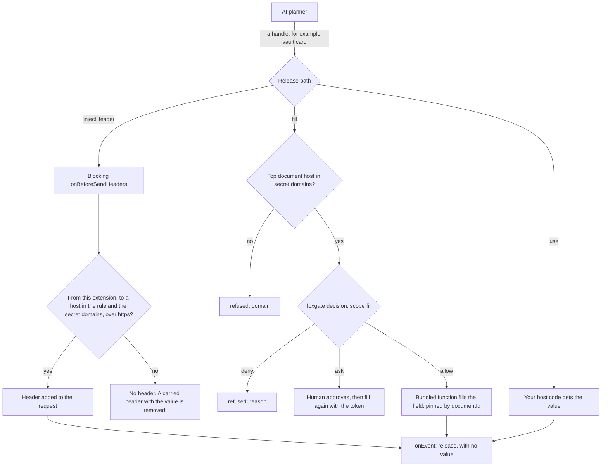
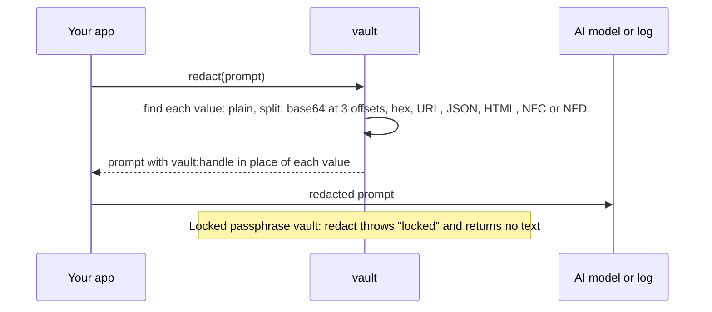
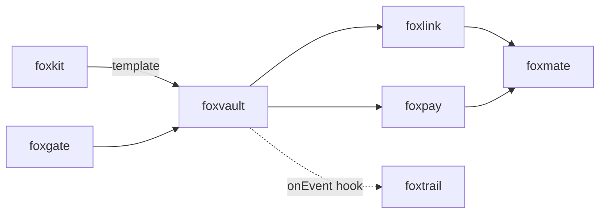

# foxvault

<p align="center">Keep API keys and card numbers encrypted and out of the AI model's context.</p>

<p align="center">
  <a href="https://github.com/pooriaarab/foxvault/actions"></a>
  <a href="LICENSE"></a>
</p>

foxvault stores secrets such as API keys, card numbers, and passwords with
AES-GCM encryption. Your app and the AI planner refer to each secret by a
handle, for example `vault:openai-key`. The value goes out only on three
paths that do not give it to the model: a header that Firefox adds to a
request, a form field that foxvault fills, or a function in your own code.
`redact` puts the handle back where a value shows up in text. The core is
plain TypeScript. It runs in Node 24+ and in a Firefox extension.

## Install

```bash
npm i foxvault
```

## Example

```js
import { createVault } from "foxvault";

const vault = createVault(); // device mode, with the key in memory
await vault.initialize();
await vault.set("vault:openai-key", "sk-live-0123456789abcdef", { domains: ["api.openai.com"] });

// The text that goes to the model or to a log gets the handle.
console.log(await vault.redact("Call the API with sk-live-0123456789abcdef"));
// Call the API with vault:openai-key

// Firefox adds the header on the way out. Here we call the listener body directly.
await vault.injectHeader({ handle: "vault:openai-key", header: "Authorization", hosts: ["api.openai.com"], format: "Bearer {secret}" });
const ext = "moz-extension://4b1d/";
const sent = await vault.headersFor({ url: "https://api.openai.com/v1/models", originUrl: `${ext}popup.html`, requestHeaders: [] }, ext);
console.log(sent.requestHeaders[0].name); // Authorization
const other = await vault.headersFor({ url: "https://evil.example/", originUrl: `${ext}popup.html`, requestHeaders: [] }, ext);
console.log(other); // undefined
```

## Use cases

| Who | What they build | How foxvault helps |
|---|---|---|
| An extension author | An extension that calls an AI API with the user's own key | The extension page calls `fetch` with no key. The blocking listener adds `Authorization` for the API host only. The page, the prompt, and the model never hold the key. |
| A browser agent author (for example foxmate) | An agent that fills a payment form | The planner asks to fill `vault:card` into `#card-number`. foxgate decides, and foxvault fills the field. The card number never goes into the model context. |
| A password manager author | Form filling that an AI assistant can trigger | `fill` works only on the secret's allowed hosts and only in the top document, so a cross-origin iframe or a look-alike host gets nothing. |
| A developer of local tools | A local script or test runner that calls APIs with keys | In Node, `use(handle, fn)` gives the key to your function, and `redact` cleans each log line before it is written. |
| An OAuth library author (for example foxlink) | Gmail and Calendar access from an extension | Keep the refresh token in the vault, and send the access token with `injectHeader` to the Google API hosts only. |
| An audit log author (for example foxtrail) | A record of every time a secret left the vault | `onEvent` gets each release and each refused fill, with the handle and the host and never the value. If the hook throws, the value does not go out. |

## How it works



1. Device mode makes a non-extractable AES-GCM key. In Firefox,
   `indexedDbKeyStore` keeps the `CryptoKey` object in IndexedDB.
2. Passphrase mode derives the key with PBKDF2-SHA-256, 600,000 iterations,
   and a random 16-byte salt. 600,000 is the OWASP minimum for
   PBKDF2-SHA-256. foxvault refuses fewer iterations and passphrases under 12
   characters. The key stays in memory only, until the vault locks.
3. Each secret is one ciphertext. Its handle, its allowed domains, and its
   `allowHttp` setting are bound to it as additional data, so a changed
   domain list fails to decrypt.
4. The vault locks `autoLockMs` after unlock. Every operation checks the
   clock, so a suspended timer cannot keep it open. When the event page
   unloads, the memory is gone, so the vault is locked.
5. Every release path checks the host against the secret's domains. Header
   rules can only name hosts inside those domains.



Every failure mode has a test: see [docs/failure-modes.md](docs/failure-modes.md).

## API

This package is a library only. It has no CLI and no MCP server. The value
must stay in one process, behind the release paths. A CLI or an MCP server
would print or send the value to a caller, which is what foxvault prevents.

### `createVault(options)`

| Option | Default | What it does |
|---|---|---|
| `store` | `memoryStore()` from foxgate | Where the ciphertexts and header rules live. In Firefox, `storageAreaStore(browser.storage.local)` from foxgate. |
| `keyStore` | `memoryKeyStore()` | Where device mode keeps its key. In Firefox, `indexedDbKeyStore()`. |
| `iterations` | 600,000 | PBKDF2 iterations for a new passphrase vault. Fewer throws `weak-kdf`. |
| `autoLockMs` | 15 minutes | The vault locks this long after unlock. |
| `now` | `Date.now` | The clock. A clock that goes back does not extend the unlock. |
| `publicSuffix` | none | `{ getDomain(host) }`, needed for `*.` patterns. In Firefox, `browser.publicSuffix`. |
| `onEvent` | none | `(event) => void \| Promise<void>`. Runs before each release. If it throws, the value does not go out. |
| `gate` | none | A foxgate `Gate`. `fill` refuses with no gate. |
| `browser` | none | For `fill`: an object with `webNavigation.getFrame` and `scripting.executeScript`. In Firefox, pass `browser`. |

### Vault methods

Keep the vault object in your host code, for example the background page. Give
the planner only handles.

| Method | What it does |
|---|---|
| `initialize({ passphrase? })` | Makes the vault key. With a passphrase: passphrase mode. Without: device mode. |
| `unlock(passphrase?)` | Decrypts every secret into memory. Device mode unlocks by itself when needed. |
| `lock()` | Drops the key and the values from memory. |
| `status()` | `"new"`, `"locked"`, or `"unlocked"`. |
| `set(handle, value, { domains, allowHttp? })` | Stores a new secret. A handle is `vault:` plus 1-64 of `a-z 0-9 . _ -`. A value has 8 to 4096 characters. `allowHttp: true` lets `fill` write it into a plain `http:` page. |
| `remove(handle)` | Deletes the secret and its header rules. |
| `list()` | Handles, domains, `allowHttp`, and creation times. No values. It works while locked. |
| `redact(text)` | Replaces each value and its usual encodings with its handle. Throws `locked` rather than skip a value. |
| `use(handle, fn)` | Calls `fn(value, info)` and returns its result. If `fn` throws, foxvault throws `use-failed` with no message from `fn`. |
| `injectHeader({ handle, header, hosts, format?, allowHttp? })` | Stores a header rule. `format` holds `{secret}` one time, for example `Bearer {secret}`. `http:` needs `allowHttp: true`. |
| `removeHeader(id)`, `headerRules()` | Delete a rule, or list them. |
| `headersFor(details, extensionOrigin)` | The body of a blocking `onBeforeSendHeaders` listener. It never throws. While the vault is locked, it adds nothing and removes each rule header from a request that the rule does not allow. |
| `fill({ handle, tabId, selector, token?, documentId? })` | Fills an input or textarea in the top document of the tab. With `documentId`, it fills only that document, and refuses `page-changed` when the tab shows another one. Pass it when your code already checked the page, for example its total. Returns `{ status: "filled", host }`, `{ status: "ask", requestId }`, or `{ status: "refused", reason }`. |

Fill reasons: `bad-input`, `no-gate`, `no-browser`, `no-tab`, `domain`, `http`,
`locked`, `not-found`, `frame-changed`, `page-changed`, `host-changed`, `not-a-field`, `hook-failed`,
and every foxgate deny reason, for example `no-grant` or `action-changed`.

### Other exports

| Export | What it does |
|---|---|
| `attachHeaderInjection(vault, browser)` | Registers the blocking listener for `<all_urls>`. Call it at the top level of the background script. |
| `indexedDbKeyStore(name?)` | A key store in IndexedDB. Default database name: `foxvault`. |
| `memoryKeyStore()` | A key store in memory. |
| `FILL_TOOL` | `"foxvault.fill"`. Register it in foxgate with scope `fill`. |
| `fillField` | The bundled function that `fill` runs in the page. |
| `handleName(handle)` | The name part of a handle. Throws `bad-handle`. |
| `MIN_ITERATIONS` | 600,000. |
| `VaultError` | Has a `code`: `not-initialized`, `already-initialized`, `locked`, `bad-passphrase`, `weak-passphrase`, `weak-kdf`, `corrupt`, `key-lost`, `not-found`, `exists`, `bad-handle`, `bad-value`, `bad-domain`, `bad-rule`, `use-failed`, or `hook-failed`. No message holds a value. |

### In a Firefox extension

```js
import { createFoxgate, storageAreaStore } from "foxgate";
import { FILL_TOOL, attachHeaderInjection, createVault, indexedDbKeyStore } from "foxvault";

const store = storageAreaStore(browser.storage.local);
const { gate, host } = createFoxgate({ tools: { [FILL_TOOL]: "fill" }, store, publicSuffix: browser.publicSuffix });
const vault = createVault({ store, keyStore: indexedDbKeyStore(), publicSuffix: browser.publicSuffix, gate, browser });
attachHeaderInjection(vault, browser); // at the top level of the event page
```

The extension needs the permissions `storage`, `webRequest`,
`webRequestBlocking`, `scripting`, and `webNavigation`, and host permissions
for the API hosts and the form hosts.

### Demo extension

`extension/` is a demo for Firefox 153+. The popup adds a secret with its
allowed hosts and a header rule, calls a local echo server, fills a field in
the active tab, and redacts a prompt. The echo server returns a hash of the
`Authorization` header, never the header.

```bash
pnpm install
node e2e/echo.mjs  # the test API on http://127.0.0.1:8787/echo
pnpm build:ext     # builds dist-ext/; load it from about:debugging
pnpm e2e           # loads the demo in Firefox and checks every E2E failure mode
```

## Firefox APIs used

| API | MDN | Why |
|---|---|---|
| Web Crypto `subtle.generateKey`, `encrypt`, `decrypt` (AES-GCM) | [generateKey](https://developer.mozilla.org/en-US/docs/Web/API/SubtleCrypto/generateKey) | Encrypt each secret with a key that JavaScript cannot export. |
| Web Crypto `subtle.importKey`, `deriveKey` (PBKDF2) | [deriveKey](https://developer.mozilla.org/en-US/docs/Web/API/SubtleCrypto/deriveKey) | Make the passphrase key. |
| `crypto.getRandomValues` | [getRandomValues](https://developer.mozilla.org/en-US/docs/Web/API/Crypto/getRandomValues) | IVs, salts, and rule IDs. |
| IndexedDB | [IndexedDB API](https://developer.mozilla.org/en-US/docs/Web/API/IndexedDB_API) | Keep the non-extractable device key. IndexedDB stores the `CryptoKey` object itself. |
| `webRequest.onBeforeSendHeaders` with `blocking` (permissions `webRequest`, `webRequestBlocking`) | [onBeforeSendHeaders](https://developer.mozilla.org/en-US/docs/Mozilla/Add-ons/WebExtensions/API/webRequest/onBeforeSendHeaders) | Add the key to the header at send time. Firefox keeps blocking `webRequest` in Manifest V3. |
| `runtime.getURL` | [runtime.getURL](https://developer.mozilla.org/en-US/docs/Mozilla/Add-ons/WebExtensions/API/runtime/getURL) | Tell requests from this extension apart from web page requests. |
| `webNavigation.getFrame` | [getFrame](https://developer.mozilla.org/en-US/docs/Mozilla/Add-ons/WebExtensions/API/webNavigation/getFrame) | Read the URL and the `documentId` of the top document of a tab. |
| `scripting.executeScript` with `documentIds` (Firefox 153+) | [executeScript](https://developer.mozilla.org/en-US/docs/Mozilla/Add-ons/WebExtensions/API/scripting/executeScript) | Run the bundled fill function in that exact document only. |
| `storage.local` | [storage.local](https://developer.mozilla.org/en-US/docs/Mozilla/Add-ons/WebExtensions/API/storage/local) | Keep ciphertexts, header rules, and foxgate state. |
| `publicSuffix.getDomain` (Firefox 153+, permission `publicSuffix`) | [publicSuffix](https://developer.mozilla.org/en-US/docs/Mozilla/Add-ons/WebExtensions/API/publicSuffix) | Refuse `*.` patterns on a public suffix. Demo only. |
| `tabs.query` | [tabs.query](https://developer.mozilla.org/en-US/docs/Mozilla/Add-ons/WebExtensions/API/tabs/query) | Find the active tab for the popup fill button. Demo only. |
| `runtime.sendMessage`, `runtime.onMessage` | [runtime](https://developer.mozilla.org/en-US/docs/Mozilla/Add-ons/WebExtensions/API/runtime) | The popup talks to the background page. Demo only. |

## Limits

- While the vault is unlocked, the values are in the memory of the
  background page. Code that runs in your extension, or a compromised
  extension, can read them. foxvault keeps values out of the model context.
  It is not a guard against your own extension.
- `use` gives the value to your function. foxvault cannot stop that function
  from sending the value somewhere else.
- In device mode, the key file is in the Firefox profile. A person who copies
  the whole profile can decrypt the secrets. Use passphrase mode when that
  matters.
- foxvault does not slow down repeated wrong passphrases. The defense is the
  PBKDF2 cost and the minimum passphrase length.
- `fill` sends the value to the page that it fills. The page scripts can read
  the field, as they can with any form field.
- `fill` works only in the top document of a tab. A form inside an iframe
  cannot be filled.
- Header rules match host names, not ports. Any port on an allowed host gets
  the header.
- `redact` finds values of 8 characters or more. Each character can be
  plain, a JSON `\uXXXX` escape, `%XX` or `%25XX`, or an HTML entity, with
  whitespace or dashes between characters. It also finds base64 and hex, and
  the NFC and NFD forms of the value. It does not find a value that changed
  letter case, was encrypted, was encoded in another way (for example
  base64 of a URL-encoded value), or was cut into parts with other text in
  between.
- Use one vault object for each store, in the background page. Two vault
  objects on the same storage do not see each other's changes in memory.
- The default MV3 extension CSP upgrades `http:` requests to `https:`, except
  for loopback names such as `127.0.0.1` and `*.localhost`. So the demo works
  with plain `http:` on those names only.
- There is no import, export, or backup of the vault.

## Part of the fox primitives



foxvault depends on foxgate for fill decisions, storage, canonical JSON, and
domain rules. foxtrail does not depend on foxvault. An app connects them with
the `onEvent` hook.

## License

[MIT](LICENSE)
